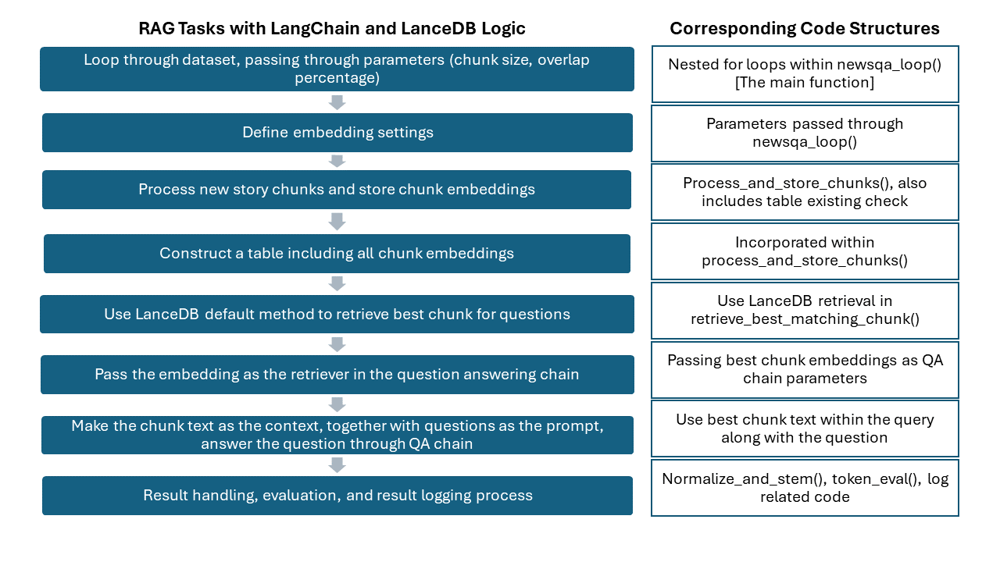

# Running Scripts Index
This file maintains different running code versions and document changes and updates to prevent confusion between different experiments. The running scripts here only include NewQA dataset scripts.

## Version 1 - Initialization

[1. newsqa_rag_script_lyang.py](https://github.com/keweimao/DeepDelight/blob/main/Thread2/Running_Scripts/1.%20newsqa_rag_script_lyang.py)  \
The first version of the full dataset running loop includes:
- Updated prompt from previous results
- CSV formatted output file

## Version 2 - Sentence Embedding

[2_newsqa_rag_script_lyang_output_fix.py](https://github.com/keweimao/DeepDelight/blob/main/Thread2/Running_Scripts/2_newsqa_rag_script_lyang_output_fix.py)  \
The difference compared to the previous version:
- Add chunk size and overlap size into the CSV output
- Add log generation

[2_newsqa_rag_script_lyang_with_normalization.py](https://github.com/keweimao/DeepDelight/blob/main/Thread2/Running_Scripts/2_newsqa_rag_script_lyang_with_normalization.py)  \
The difference compared to the previous version:
- Add chunk size and overlap size into the CSV output
- Add log file generation
- **Add normalization and stemming before comparing predicted and actual answers**
- **Fix normalized sentence output newline issue [1/26/2024]**

[2_2_newsqa_rag_script_lyang_with_sentence_and_dist.py](https://github.com/lixiao-yang/DeepDelight/blob/main/Thread2/Running_Scripts/2_2_newsqa_rag_script_lyang_with_sentence_and_dist.py) \
The difference compared to the previous version:
- Add chunk size and overlap size into the CSV output
- Add log file generation
- Add normalization and stemming before comparing predicted and actual answers
- Fix normalized sentence output newline issue [1/26/2024]
- **Add sentence-based structure with adjustable parameter `top_n_sentences`**
- **Add parameter `dist_functions` to enable cosine/pairwise distance calculations**

[2_3_newsqa_rag_script_lyang_sentence_revised.py](https://github.com/keweimao/DeepDelight/blob/main/Thread2/Running_Scripts/2_3_newsqa_rag_script_lyang_sentence_revised.py) \
The difference compared to the previous version:
- ~~Add chunk size and overlap size into CSV output~~
- **Modified log and CSV file output [1/30/2024]**
- Add normalization and stemming before comparing predicted and actual answers
- Fix normalized sentence output newline issue [1/26/2024]
- Add sentence-based structure and with adjustable parameter `top_n_sentences`
- Add parameter `dist_functions` to enable cosine/pairwise distance calculations
- **Incorporate `top_nsentences` and `dist_functions` as lists of parameters to enable loop**

[2_3_2_newsqa_rag_script_lyang_sentence_long_context.py](https://github.com/lixiao-yang/DeepDelight/blob/main/Thread2/Running_Scripts/2_3_2_newsqa_rag_script_lyang_sentence_long_context.py) \
The difference compared to the previous version:
- ~~Add chunk size and overlap size into CSV output~~
- Modified log and CSV file output [1/30/2024]
- Add normalization and stemming before comparing predicted and actual answers
- Fix normalized sentence output newline issue [1/26/2024]
- Add sentence-based structure with adjustable parameter `top_n_sentences`
- Add parameter `dist_functions` to enable cosine/pairwise distance calculations
- Incorporate `top_nsentences` and `dist_functions` as lists of parameters to enable loop
- **Increased maximum tokens allowed to 5000 and add `max_tokens` as an adjustable parameter**

[2_4_newsqa_rag_script_lyang_whole_story.py](https://github.com/keweimao/DeepDelight/blob/main/Thread2/Running_Scripts/2_4_newsqa_rag_script_lyang_whole_story.py) \
The difference compared to the previous version:
- ~~Add chunk size and overlap size into CSV output~~
- Add log file generation
- Add normalization and stemming before comparing predicted and actual answers
- Add sentence-based structure with adjustable parameter `top_n_sentences`
- Add parameter `dist_functions` to enable cosine/pairwise distance calculations
- **Whole story as the prompt**

## Version 3 - LangChain with LanceDB for RAG
 
[3_newsqa_rag_vector_search.py](https://github.com/lixiao-yang/DeepDelight/blame/main/Thread2/Running_Scripts/3_newsqa_rag_lancedb.py)
The difference compared to the previous version:
- Major code structure revision
  - Integrate evaluation metrics into ```token_eval()```
  - Add ```process_story_and_store_chunks()``` for creating LanceDB tables and local storage: For each story, construct a unique table that contains the embedding information based on different `story_id`, `chunk_size`, `overlap_size`, `embedding_method` and save the table into LanceDB
  - Add `db_dir`: LanceDB local storage directory
  - Add `embedding_function_name`: Expand the embedding as a new parameter for potential new embedding methods.
 - Remove `top_n_sentences` and `dist_functions`, replace them with `similarity_search_by_vector()`, and potentially expand to other probability-based IR methods (e.g. BM25)
- Consolidate import libraries and switch the model into `mistral-7b` to simplify the cross-machine code running
- Modify memory release code
- Use `similarity_search_by_vectors()` for sentence retrieval

[3_1_newsqa_lancedb_full.py](https://github.com/lixiao-yang/DeepDelight/blob/main/Thread2/Running_Scripts/3_1_newsqa_lancedb_full.py)
The difference compared to the previous version:
- Major code structure revision
  - Integrate evaluation metrics into `token_eval()`
  - ~~Add `process_story_and_store_chunks()` for creating LanceDB tables and local storage:~~ Replace the previous function with the new `process_and_store_chunks()` which checks whether the given table exists in the directory and proceed, if not, create the table using passed parameters. For each story, construct a unique table that contains the embedding information based on different `story_id`, `chunk_size`, `overlap_size`, and `embedding_method` and save the table into LanceDB. 
  - Add `db_dir`: LanceDB local storage directory
  - Add `embedding_function_name`: Expand the embedding as a new parameter for potential new embedding methods.
  - ~~Remove `top_n_sentences` and `dist_functions`, replace them with `similarity_search_by_vector()`, and potentially expand to other probability-based IR methods (e.g. BM25)~~ Restore `top_n_chunks` to enable choosing the top n chunks from LanceDB retrieval result ranks
  - Create `retrieve_best_matching_chunk()` to use LanceDB default search methods to retrieve `top_n_chunks` from the LanceDB tables.
    - Add `similarity_func()` within LanceDB search, including default adjustable search metrics ("cosine", "l2", "dot)
- Consolidate import libraries and switch the model into `mistral-7b` to simplify the cross-machine code running
- Modify memory release code
- Fix folder and table directory issue: removing the './cnn/' prefix and '.story' suffix to avoid database path issues.
- Use ~~`similarity_search_by_vectors()`~~ `similarity_search()` for sentence retrieval, this function should return the same result as `similarity_search_by_vectors()` (may cause vector scalable issue using the previous function)
- Delete prompt template parameter, simplify code structure, and incorporate the query within the `newsqa_loop()` function.

**Code Structure Illustration:** \

